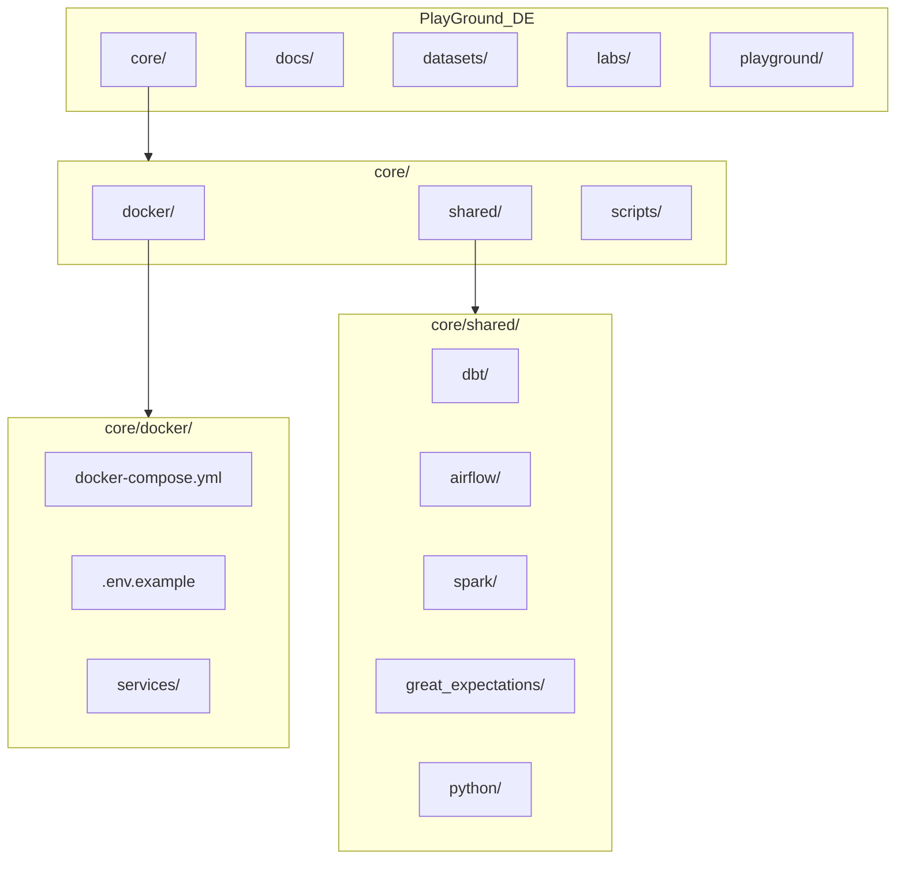

# Data Engineering Learning Platform — Bootstrap Plan

## Current State

The repository contains only Cursor meta-configuration:

- [`.cursor/index.md`](.cursor/index.md) — entry point and role constraints
- [`.cursor/rules/platform_rules.md`](.cursor/rules/platform_rules.md) — platform architect rules (aligned with your mission doc)
- [`.cursor/bootstrap/init.md`](.cursor/bootstrap/init.md) — bootstrap checklist
- [`.cursor/context/context.md`](.cursor/context/context.md) — empty (will track platform state)
- [`.cursor/skills/skills.md`](.cursor/skills/skills.md) — empty registry (will track reusable patterns)

No application directories exist yet. This plan scaffolds the full platform skeleton only — **no labs, no business logic, no SQL/dbt/Spark implementations**.

---

## Target Repository Layout



```
PlayGround_DE/
├── README.md
├── .gitignore
├── core/
│   ├── docker/
│   │   ├── docker-compose.yml
│   │   ├── .env.example
│   │   └── services/
│   │       ├── postgres/
│   │       ├── airflow/
│   │       ├── spark/
│   │       └── minio/
│   ├── shared/
│   │   ├── dbt/
│   │   ├── airflow/
│   │   ├── spark/
│   │   ├── great_expectations/
│   │   └── python/
│   └── scripts/
├── docs/
│   ├── architecture/
│   ├── concepts/
│   └── cheatsheets/
├── datasets/
│   ├── csv/
│   ├── json/
│   └── parquet/
├── labs/
│   └── README.md          # lab index + progression roadmap (no labs yet)
└── playground/
    └── README.md
```

---

## 1. Root-Level Files

### [`README.md`](README.md)
- Platform purpose (learning environment, not a product)
- Quick start: how to start services by profile
- Directory map pointing to `docs/architecture/overview.md`
- Explicit note: business logic lives in `labs/` and is implemented by the user

### [`.gitignore`](.gitignore)
Standard ignores for a DE monorepo:
- Python (`__pycache__`, `.venv`, `*.pyc`)
- dbt (`target/`, `dbt_packages/`, `logs/`)
- Airflow (`logs/`, `airflow.db`)
- Docker (`.env` — keep `.env.example` tracked)
- Spark (`metastore_db/`, `derby.log`, checkpoint dirs)
- IDE/OS artifacts

---

## 2. Docker Compose — Profile-Based Infrastructure

**File:** [`core/docker/docker-compose.yml`](core/docker/docker-compose.yml)

Single compose file with on-demand profiles. Conventional, boring stack versions:

| Service | Image / approach | Profile | Purpose |
|---------|------------------|---------|---------|
| PostgreSQL 16 | `postgres:16-alpine` | `postgres` | Primary relational store |
| Airflow 2.x | `apache/airflow:2.10-python3.11` | `airflow` | Orchestration (LocalExecutor) |
| Spark 3.5 | `bitnami/spark:3.5` | `spark` | Batch processing (standalone) |
| MinIO | `minio/minio` | `minio` | S3-compatible object storage |

**Design decisions (conventional over clever):**
- **LocalExecutor** for Airflow — simplest realistic setup for a laptop learning env; no Redis/Celery overhead
- **Named volumes** for postgres, airflow, minio data persistence
- **Healthchecks** on postgres and minio so dependent services can wait cleanly
- **Shared network** (`de-network`) across all profiles
- Airflow mounts [`core/shared/airflow/dags/`](core/shared/airflow/dags/) and a lab-agnostic `plugins/` dir
- Spark exposes master UI on a documented port; worker connects to master
- MinIO exposes API + console ports with documented default credentials in `.env.example`

**File:** [`core/docker/.env.example`](core/docker/.env.example)

Documented variables:
```
POSTGRES_USER, POSTGRES_PASSWORD, POSTGRES_DB, POSTGRES_PORT
AIRFLOW_UID, AIRFLOW_PORT
SPARK_MASTER_PORT, SPARK_WORKER_PORT
MINIO_ROOT_USER, MINIO_ROOT_PASSWORD, MINIO_PORT, MINIO_CONSOLE_PORT
```

**Service subdirectories** under `core/docker/services/`:
- `postgres/init/` — empty `.gitkeep` + placeholder `01_init.sql` with `# TODO: shared schema bootstrap if needed`
- `airflow/` — `Dockerfile` only if custom deps needed; otherwise use official image + requirements mount
- `spark/` — optional `spark-defaults.conf` stub
- `minio/` — `.gitkeep` (MinIO needs no custom config at bootstrap)

**Example usage** (documented in README):
```bash
docker compose --profile postgres up -d
docker compose --profile postgres --profile airflow up -d
```

---

## 3. Shared Tool Skeletons (TODO-only, no logic)

### dbt — [`core/shared/dbt/`](core/shared/dbt/)
Minimal project skeleton:
- `dbt_project.yml` — project name `de_learning`, profile `de_postgres`
- `profiles.yml.example` — host `localhost`, port from env, placeholder creds
- `models/.gitkeep` + `models/_schema.yml` with `# TODO: define sources and models`
- `seeds/.gitkeep`
- `macros/.gitkeep`
- `tests/.gitkeep`
- `README.md` — how labs extend or reference this shared project

### Airflow — [`core/shared/airflow/`](core/shared/airflow/)
- `dags/_template_dag.py` — skeleton DAG with `# TODO` task placeholders (PythonOperator stubs, no business logic)
- `plugins/.gitkeep`
- `requirements.txt` — empty or minimal (`apache-airflow-providers-postgres`)
- `README.md` — how to mount DAGs, run with profile

### Spark — [`core/shared/spark/`](core/shared/spark/)
- `jobs/_template_job.py` — `SparkSession` bootstrap + `# TODO: implement transformation`
- `conf/spark-defaults.conf` — commented defaults
- `README.md` — how to submit jobs against the spark profile

### Great Expectations — [`core/shared/great_expectations/`](core/shared/great_expectations/)
- `great_expectations.yml` — minimal config stub pointing at postgres
- `expectations/.gitkeep`
- `checkpoints/.gitkeep`
- `README.md` — how labs add suites

### Python shared — [`core/shared/python/`](core/shared/python/)
- `requirements.txt` — pinned core deps: `psycopg2-binary`, `pandas`, `requests`, `duckdb`, `great-expectations`, `dbt-postgres` (versions documented, not bleeding edge)
- `de_shared/__init__.py`
- `de_shared/db.py` — connection helper stub with `# TODO: implement get_connection()`
- `de_shared/config.py` — env-var reader stub with `# TODO`
- Keep minimal — no framework, no ORM

---

## 4. Helper Scripts — [`core/scripts/`](core/scripts/)

| Script | Purpose |
|--------|---------|
| `up.sh` | Wrapper: `docker compose --profile "$1" up -d` from `core/docker/` |
| `down.sh` | Tear down profiles or all |
| `wait-for-postgres.sh` | Simple pg_isready loop for lab scripts |
| `README.md` | Usage examples |

Scripts will be thin bash wrappers — no magic.

---

## 5. Documentation — [`docs/`](docs/)

### [`docs/architecture/overview.md`](docs/architecture/overview.md)
- Platform diagram (services, profiles, lab relationship)
- Monorepo layout explanation
- How labs reuse `core/shared/` vs. lab-local code
- Profile composition rules ("never assume full stack is running")

### [`docs/architecture/lab-progression.md`](docs/architecture/lab-progression.md)
- Planned scenario-based lab sequence (from your mission doc):
  1. `csv_to_postgres`
  2. `rest_api_to_raw`
  3. `incremental_loading`
  4. `dwh_modeling`
  5. `dbt_transformations`
  6. `data_quality`
  7. `airflow_orchestration`
  8. `scd_and_history`
  9. `analytics_marts`
  10. `spark_batch_processing`
  11. `large_dataset_processing`
  12. `end_to_end_platform`
- Each entry: one-line scenario description, prerequisites, profiles needed — **no exercise content**

### [`docs/concepts/README.md`](docs/concepts/README.md) — index placeholder
### [`docs/cheatsheets/README.md`](docs/cheatsheets/README.md) — index placeholder

---

## 6. Datasets & Playground

### [`datasets/`](datasets/)
- Subdirs: `csv/`, `json/`, `parquet/` each with `.gitkeep`
- [`datasets/README.md`](datasets/README.md) — naming conventions, how labs reference shared vs. lab-local datasets

### [`labs/README.md`](labs/README.md)
- Lab structure contract (from mission doc)
- Pointer to `docs/architecture/lab-progression.md`
- Note: "No labs scaffolded yet — request one by scenario name"

### [`playground/README.md`](playground/README.md)
- Free-form experiments; not part of the curriculum; no guarantees of stability

---

## 7. Cursor Meta Updates

After scaffolding, update Cursor state files so future sessions inherit context:

### [`.cursor/context/context.md`](.cursor/context/context.md)
- Platform version / bootstrap date
- Available Docker profiles
- Shared skeleton locations
- Lab count: 0
- Next recommended lab: `csv_to_postgres`

### [`.cursor/skills/skills.md`](.cursor/skills/skills.md)
Register reusable patterns created during bootstrap:
- Docker profile names and compose location
- dbt project path and profile name
- Airflow DAG template path
- Spark job template path
- GE config path
- Lab scaffold checklist (from `init.md`)

No changes needed to [`.cursor/rules/platform_rules.md`](.cursor/rules/platform_rules.md) — already aligned with the mission doc.

---

## 8. What This Plan Explicitly Does NOT Include

Per your mission constraints:
- No lab directories (user chose skip)
- No SQL queries, dbt models, ETL logic, or Spark transformations
- No sample datasets committed (only empty dataset dirs)
- No Kafka, Terraform, K8s, Prometheus, or Grafana
- No custom frameworks or abstraction layers
- No CI/CD pipeline (can be added later if requested)

---

## Verification Checklist (post-implementation)

1. `tree` shows full directory layout with no unexpected nesting
2. `docker compose --profile postgres config` validates without error
3. All skeleton files contain `TODO` placeholders, not implementations
4. `.env.example` documents all required variables; `.env` is gitignored
5. Root README explains profile-based startup in under 2 minutes of reading
6. `.cursor/context/context.md` reflects bootstrap state
