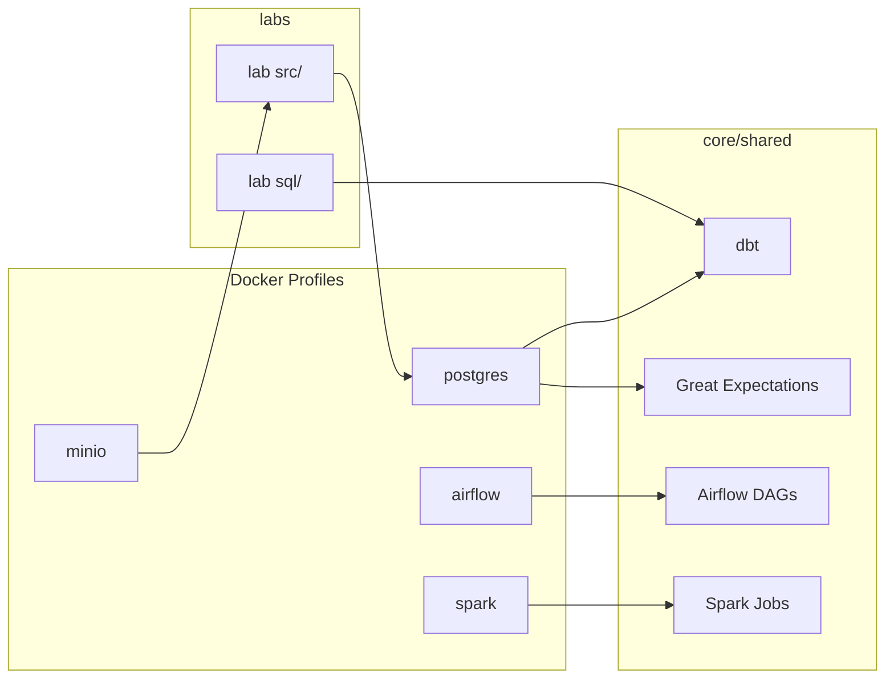

# Platform Architecture Overview

## Purpose

PlayGround DE is a monorepo learning platform that simulates a production Data Engineering environment. Infrastructure is standardized; business logic lives in `labs/` and is implemented by the learner.

## High-Level Layout

```
PlayGround_DE/
├── core/           Shared infrastructure and tool skeletons
├── labs/           Scenario-based learning modules
├── datasets/       Shared input data
├── docs/           Knowledge base
└── playground/     Free-form experiments
```

## Service Architecture

Services run on demand via Docker Compose profiles. Never assume the full stack is running.



## Profile Composition

| Profile | Depends On | Use Case |
|---------|------------|----------|
| `postgres` | — | SQL, dbt, GE, general storage |
| `airflow` | `postgres` | Pipeline orchestration |
| `spark` | — | Distributed batch processing |
| `minio` | — | S3-compatible object storage |

Start only what you need:

```bash
./core/scripts/up.sh postgres          # SQL / dbt labs
./core/scripts/up.sh postgres airflow  # orchestration labs
./core/scripts/up.sh spark             # Spark labs
./core/scripts/up.sh minio             # object storage labs
```

## Core vs. Lab Code

| Location | Contains | Maintained By |
|----------|----------|---------------|
| `core/docker/` | Compose profiles, service config | Platform |
| `core/shared/` | Tool skeletons (dbt, Airflow, Spark, GE) | Platform |
| `core/scripts/` | Helper scripts | Platform |
| `labs/<name>/src/` | Lab-specific Python/Spark/Airflow code | Learner |
| `labs/<name>/sql/` | Lab-specific SQL/dbt models | Learner |
| `labs/<name>/tests/` | Lab-specific tests | Learner |

Labs reuse `core/shared/` templates by copying or extending them. Platform code never implements lab business logic.

## Lab Structure Contract

Every lab follows:

```
labs/<lab_name>/
├── README.md
├── problem_statement.md
├── notes.md
├── datasets/
├── src/
├── sql/
└── tests/
```

Additional folders are added only when justified (e.g. a lab-specific Docker profile override).

## Design Principles

1. **Scenario-based** — labs represent business scenarios, not tools.
2. **Incremental** — each lab builds on previous knowledge.
3. **Independently runnable** — labs should work with minimal profile composition.
4. **Boring and conventional** — production-like patterns without unnecessary complexity.
5. **Skeletons, not solutions** — platform provides structure; learner implements logic.

See [lab-progression.md](lab-progression.md) for the planned lab sequence.
